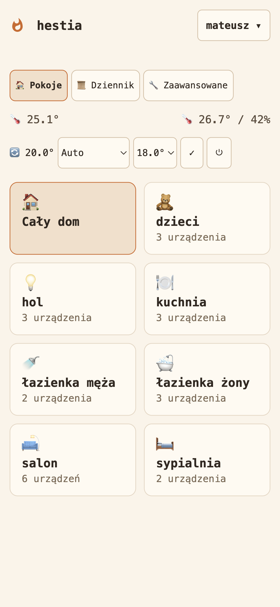
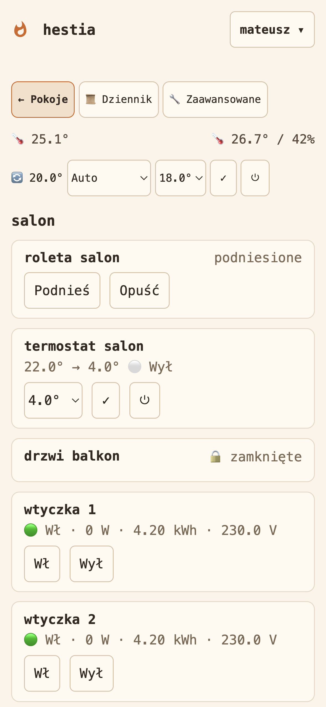
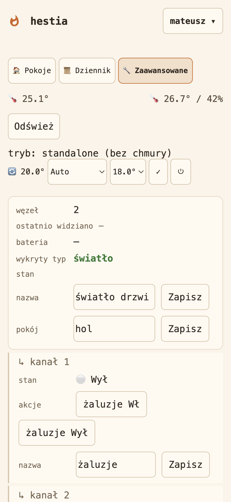
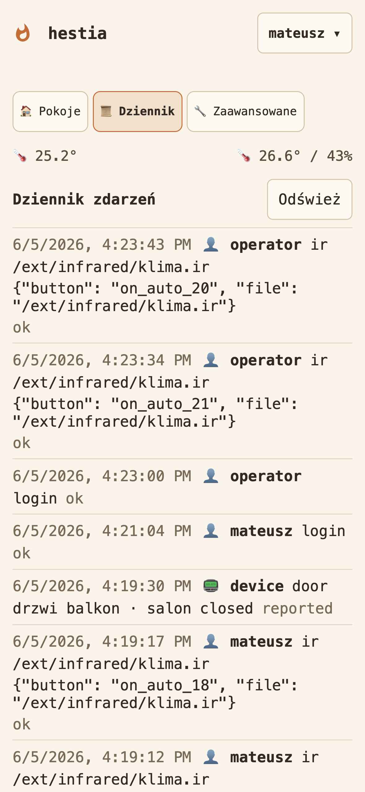

# hestia

Local, cloud-free control for **Keemple** smart-home devices (roller-shutter /
blind controllers, switches, dimmers, thermostats, smart plugs, and sensors built
on Hi-Flying Wi-Fi and WCH Ethernet serial-bridge modules).

These devices phone home to a vendor cloud over a **cleartext, custom
`0x7e`-framed binary protocol**. hestia reimplements that protocol locally, so the
devices talk to *it* instead of the cloud — no dependency on the vendor cloud, no
third-party CDN, no public IP. Run it as a transparent **proxy** (relay to the
cloud while decoding everything) or as a **standalone** server that *replaces* the
cloud entirely.



> **Runs completely off-grid.** In standalone mode hestia replaces the vendor cloud
> entirely, and a local **RTL-SDR (`rtl_433`)** feeder brings 433 MHz **temperature
> & humidity** sensors in on-device — no gateway, no internet.

| Rooms | Room control | Engineer view (standalone) | Activity / audit log |
| --- | --- | --- | --- |
|  |  |  |  |

<sub>(Screenshots are sanitised: masked metering values and demo account names.)</sub>

hestia began as a **zero-dependency, pure-stdlib** server on bare metal. Now that it
ships in a container, that rule is deliberately relaxed for **vetted,
generic-infrastructure** libraries — currently
[`cryptography`](https://pypi.org/project/cryptography/) (the AES-128 primitive for
the optional Tuya client) and [`pyserial`](https://pypi.org/project/pyserial/)
(USB-CDC transport for the optional Flipper Zero IR client). The Keemple
protocol / command / state codec — the clean-room asset — stays **pure-stdlib,
first-party** code; the libraries supply only generic primitives (a block cipher, a
serial port), never protocol logic.

The **TypeScript + Vite** dashboard lives in [`ui/`](ui/) (built to `ui/dist`) and is
served at the root `/`; the legacy stdlib inline dashboard has been removed. The web
layer runs on **aiohttp**, with optional **SQLite** persistence (SQLAlchemy + Alembic)
for device state, per-user settings, and accounts.

## Clean-room methodology

hestia was built clean-room, in two separate roles:

1. **Observation → specification.** One group worked only from **passive,
   on-the-wire observation** of the gateway's own cleartext LAN traffic, correlated
   with labelled user actions and the app's activity log, and wrote it up as
   [`docs/PROTOCOL.md`](docs/PROTOCOL.md). No firmware, no decompilation, no binary
   analysis.
2. **Specification → implementation.** A second group implemented the codec,
   servers, and tooling **solely from `docs/PROTOCOL.md`** — not from the raw
   traffic. Implementation comments and tests therefore cite sections of
   `PROTOCOL.md`, not captures.

The optional pcap helpers (`tools/decode_stream.py`, `tools/pcap_frames.py`,
`tools/pcap_audit.py`) let you re-derive the same observations from your **own**
local captures; they are validation aids, not the source of the spec.

## Run

```sh
python3 -m hestia            # proxy (default) or standalone, per HESTIA_MODE / persisted mode
# or in Docker (host networking, so it sees real device source IPs):
docker compose up -d --build
```

To make the devices reach hestia instead of the cloud, redirect the gateway's
cloud hostname to this host (e.g. a local DNS override) and/or an iptables
PREROUTING redirect on `:8925`. An extra LAN-IP alias on this host lets an Ethernet
unit that dials a fixed local gateway connect with zero device-side change. See
[`docs/PROTOCOL.md`](docs/PROTOCOL.md) for the wire protocol and the connection
sequence.

## What it does

- **Decodes & forges** the full protocol: framing + TLV codec, every actuator
  command (blinds, dimmers, switches, thermostats, scene/function buttons) and
  every sensor/state report (doors, motion, smoke/flood, smart-plug power
  metering), the login/handshake, and the device roster.
- **Live web dashboard** (TypeScript SPA over SSE): a room-grouped home view,
  thermostat / A·C / blind / scene control, per-node state, smart-plug power
  metering, battery %, inline naming, and a guided local rules editor. Multi-user
  **auth + role-based access** (admin / operator / viewer), a full **audit / activity
  log**, and **45 UI locales** (with RTL).
- **Automations engine** — a local, cloud-free rules engine: event / time / cron /
  sun / presence / global-field triggers → conditioned, debounced actions. See
  [`docs/AUTOMATIONS.md`](docs/AUTOMATIONS.md).
- **Local sensor inputs via RTL-SDR** — an `rtl_433` feeder (baked into the Docker
  image) streams 433 MHz **temperature & humidity** sensors in locally; no gateway,
  no cloud.
- **Optional integrations** (all opt-in, off by default): a Tuya v3.3 LAN
  client for a temperature device ([`docs/TUYA.md`](docs/TUYA.md)), an
  outdoor-temperature poller (Open-Meteo), and IR control via a serial-attached
  transmitter.

## Tests

```sh
python3 -m unittest discover -s tests
```

100 % line + branch coverage (stdlib `unittest`; `.coveragerc` `fail_under=100`).
